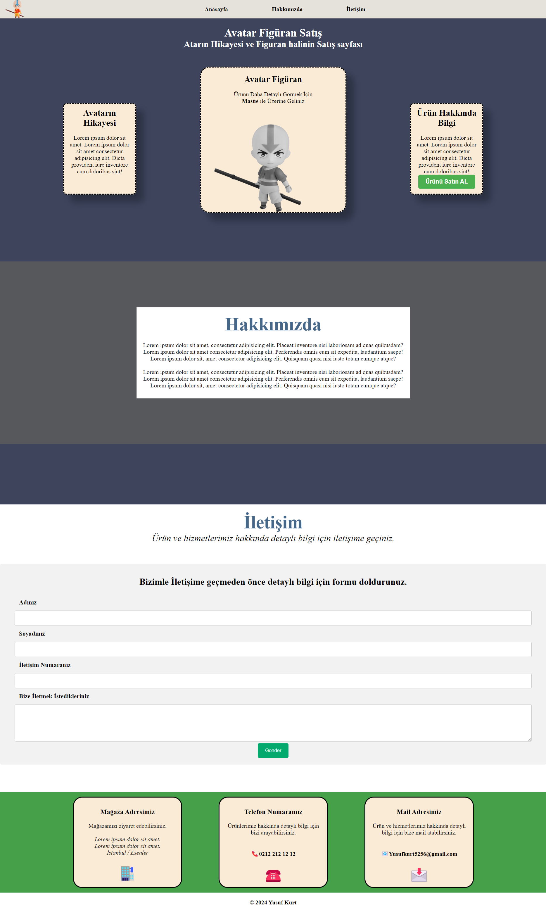

# Kodluyoruz Html Bölüm Sonu Çalışması

Kodluyoruz **Html + CSS Eğitimi** kapsamında yaptığım çalışma

- Avatar Figürü satan bir satış sayfası gibi yapmaya çalıştım.
- index.html, iletisim.html, hakkimizda.html olarak 3 bölümden oluşuyor.
- Sitenin Görünümü ;



## Installation

Öncelikle Projeyi Clonelayın

```
https://github.com/ykurt56/ilk-HTML-CSS-sitesi.git
```

## Usage

Projeyi cloneladıktan sonra Visual Studio Code programında açınız.
Lunix için:

    cd ilk-HTML-CSS-sitesi
    code .
